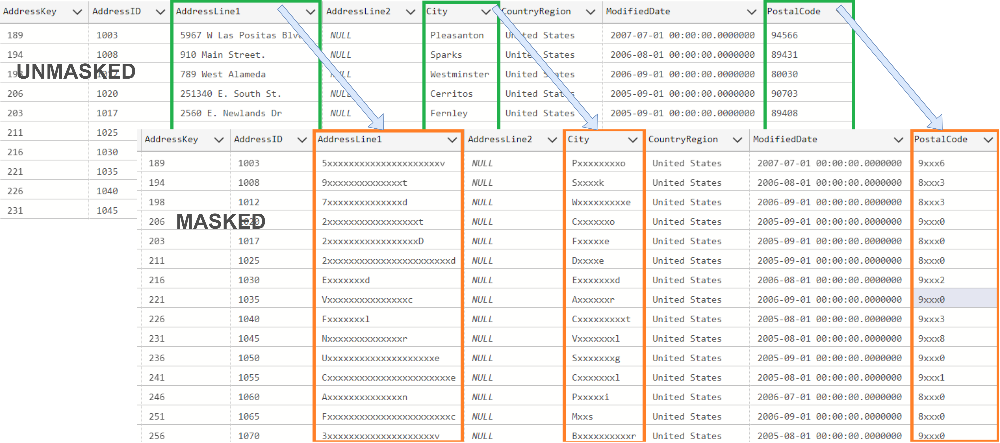
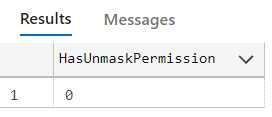
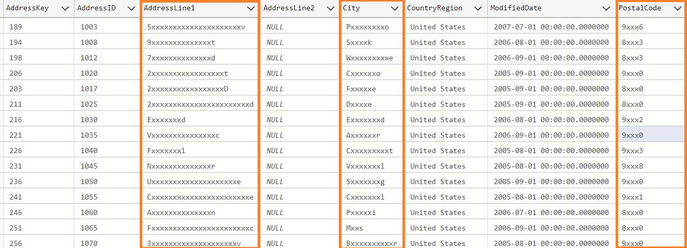
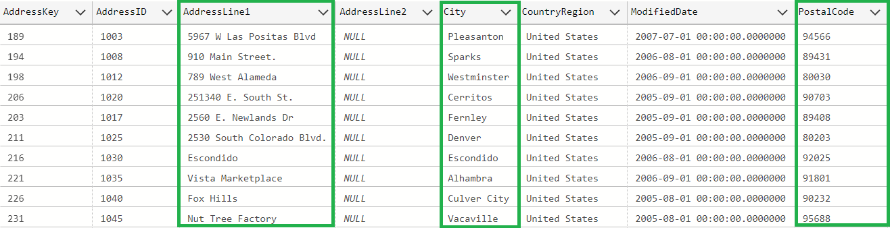
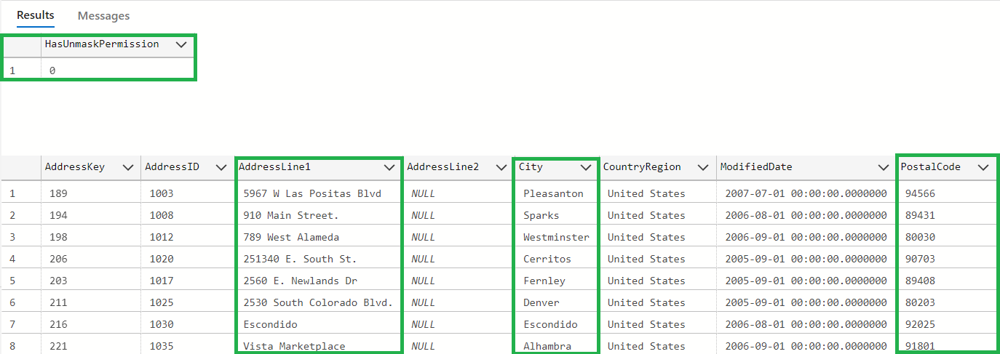
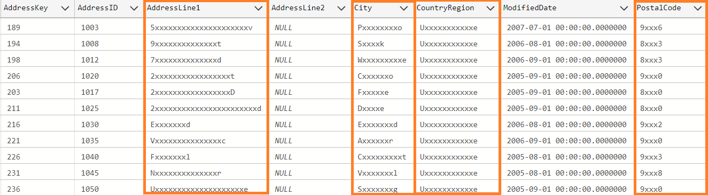

# Azure Synapse Serverless Dynamic Data Masking

## Concept
Depending on permissions (**MASK/UNMASK**) users see mask/unmasked data (columns)



## Instalation

- Run [Setup Script](src/Setup.sql)

#### Setup scrips creates:
- **utils** schema (SPs)
- **masked** schema - masked views will be (by default) created in this schema
- **utils.usp_CreateOrRefreshMaskedView** SP

##### utils.usp_CreateOrRefreshMaskedView Stored Procedure

This procedure creates/(or replaces existing) masked view based on existing view
**Parameters:**

Name| Description | Sample Values
---------|----------|---------
 @full_view_name NVARCHAR(255)| Full source view name | dbo.DimAddress
 @column_list_to_mask NVARCHAR(MAX) | List of columns to mask | City,PostalCode,AddressLine1
 @masked_schema_name NVARCHAR(255) | Optional. Sink schema name - new views will be created in this schema (by default masked) | masked

 **Example:**
```sql
DECLARE @full_view_name NVARCHAR(255) = 'dbo.DimAddress';
DECLARE @column_list_to_mask NVARCHAR(max) = 'City,PostalCode,AddressLine1';
DECLARE @masked_schema_name NVARCHAR(255) = 'masked'

EXEC utils.usp_CreateOrRefreshMaskedView
     @full_view_name,
	 @column_list_to_mask,
	 @masked_schema_name
``` 

## Data masking/unmasking permissions

Permisssion model is built based on **MASK** and **UNMASK** permission and function [HAS_PERMS_BY_NAME](https://learn.microsoft.com/en-us/sql/t-sql/functions/has-perms-by-name-transact-sql?view=sql-server-ver16)

MASK permission is defined on the schema level.

Check unmask permission to schema **masked** for current user:
```sql
SELECT HAS_PERMS_BY_NAME('masked', 'SCHEMA', 'UNMASK');
```

## Sample usage
### Prerequisites
- Setup dynamic data masking module 
- Create sample user 
```sql
CREATE LOGIN MaskingTestUser WITH PASSWORD ='P@ssw0rd1234$';
CREATE USER MaskingTestUser FROM LOGIN MaskingTestUser; 
```
- Define permission to use BULK OPERATION and CREDENTIALS on Azure Synpase Serverless
```sql
GRANT  REFERENCES ON DATABASE SCOPED CREDENTIAL ::DataLakeManagedIdentityCredential TO MaskingTestUser;
GRANT ADMINISTER DATABASE BULK OPERATIONS TO MaskingTestUser;
```
- Create some views on Azure Synapse Serverless e.g. based on OPENROWSET
e.g. 
```sql
CREATE VIEW [dbo].[DimAddress]
AS
SELECT *
FROM OPENROWSET(BULK 'DLHDev/dimaddress', DATA_SOURCE = 'ServeDataSource', FORMAT = 'DELTA') WITH (
        AddressKey BIGINT
        , AddressID INT
        , AddressLine1 NVARPCHAR(255)
        , AddressLine2 NVARCHAR(255)
        , City NVARCHAR(255)
        , CountryRegion NVARCHAR(255)
        , ModifiedDate DATETIME2(7)
        , PostalCode NVARCHAR(255)
        , rowguid NVARCHAR(255)
        , StateProvince NVARCHAR(255)
        , DlhDmlAction INT
        , DlhEtlProcLogId BIGINT
        , DlhInsertEtlProcLogId BIGINT
        , DlhIsCurrent BIT
        , DlhIsDeleted BIT
        , DlhLoadDate DATETIME2(7)
        , DlhRowHash NVARCHAR(255)
        , DlhUpdateEtlProcLogId BIGINT
        , DlhValidFrom DATETIME2(7)
        , DlhValidTo DATETIME2(7)
        , DlhVersion INT
        ) r
GO
```
- Grand Permission to **masked** schema
```sql
GRANT SELECT ON SCHEMA::masked TO MaskingTestUser;
```
- Test **MASK/UNMASK** permission
```sql
EXECUTE AS USER = 'MaskingTestUser';
SELECT HAS_PERMS_BY_NAME('masked', 'SCHEMA', 'UNMASK') AS HasUnmaskPermission;
REVERT;
```

### Example
- Create masked view based on existing **[dbo].[DimAddress]** view
   - Masked columns **City,PostalCode,AddressLine1**

```sql
DECLARE @full_view_name NVARCHAR(255) = 'dbo.DimAddress';
DECLARE @column_list_to_mask NVARCHAR(max) = 'City,PostalCode,AddressLine1';
DECLARE @masked_schema_name NVARCHAR(255) = 'masked'

EXEC utils.usp_CreateOrRefreshMaskedView
     @full_view_name,
	 @column_list_to_mask,
	 @masked_schema_name
```
- Run query - no unmask permission
```sql
EXECUTE AS USER = 'MaskingTestUser';
SELECT HAS_PERMS_BY_NAME('masked', 'SCHEMA', 'UNMASK') AS HasUnmaskPermission;
SELECT * FROM masked.DimAddress;
REVERT;
```


- Add **MASK** permission
```sql
GRANT UNMASK ON SCHEMA::[masked] TO MaskingTestUser;
```
- Run query - user has defined unmask permission
```sql
EXECUTE AS USER = 'MaskingTestUser';
SELECT HAS_PERMS_BY_NAME('masked', 'SCHEMA', 'UNMASK') AS HasUnmaskPermission;
SELECT * FROM [masked].DimAddress;
REVERT;
```


- Remove masking from view
  - run SP with NULL @column_list_to_mask parameter

```sql
DECLARE @full_view_name NVARCHAR(255) = 'dbo.DimAddress';
DECLARE @column_list_to_mask NVARCHAR(max) = NULL;
DECLARE @masked_schema_name NVARCHAR(255) = 'masked'

EXEC utils.usp_CreateOrRefreshMaskedView
     @full_view_name,
	 @column_list_to_mask,
	 @masked_schema_name
```
- Test view (after update)
```sql
EXECUTE AS USER = 'MaskingTestUser';
SELECT HAS_PERMS_BY_NAME('masked', 'SCHEMA', 'UNMASK') AS HasUnmaskPermission;
SELECT * FROM masked.DimAddress;
REVERT;
```


- Create (once again) view with masking 

```sql
DECLARE @full_view_name NVARCHAR(255) = 'dbo.DimAddress';
DECLARE @column_list_to_mask NVARCHAR(max) = 'City,PostalCode,AddressLine1';
DECLARE @masked_schema_name NVARCHAR(255) = 'masked'

EXEC utils.usp_CreateOrRefreshMaskedView
     @full_view_name,
	 @column_list_to_mask,
	 @masked_schema_name
```

- Add new column to mask
  - new column **CountryRegion**  
```sql
DECLARE @full_view_name NVARCHAR(255) = 'dbo.DimAddress';
DECLARE @column_list_to_mask NVARCHAR(max) = 'City,PostalCode,AddressLine1,CountryRegion';
DECLARE @masked_schema_name NVARCHAR(255) = 'masked'

EXEC utils.usp_CreateOrRefreshMaskedView
     @full_view_name,
	 @column_list_to_mask,
	 @masked_schema_name
```
- Test new view
```sql
EXECUTE AS USER = 'MaskingTestUser';
SELECT HAS_PERMS_BY_NAME('masked', 'SCHEMA', 'UNMASK') AS HasUnmaskPermission;
SELECT * FROM masked.DimAddress;
REVERT;
```


## Data masking functions

|Function type  | Supported data types | Masking patter  |
|---|---|---|
| string | <ul><li>text</li><li>ntext</li><li>varchar</li><li>char</li><li>nvarchar</li><li>nchar</li><li>sysname</li></ul> |First letter+xxx+last letter   |
| numeric | <ul><li>tinyint</li><li>smallint</li><li>int</li><li>real</li><li>money</li><li>float</li><li>decimal</li><li>numeric</li><li>smallmoney</li><li>bigint</li></ul> | 0 | 
| date/datetime | <ul><li>date</li><li>datetime2</li><li>datetime</li><li>timestamp</li></ul>| 2000-01-01 |
| boolean | <ul><li>bit</li></ul> | 0 |

### String function

```sql
CAST(IIF(LEN([{column_title}]) <=2, ''X''+REPLICATE(''x'',LEN([{column_title}])-1),SUBSTRING([{column_title}],1,1)+ REPLICATE(''x'',LEN([{column_title}])-2) + SUBSTRING([{column_title}],LEN([{column_title}])-1,1) ) AS {column_datatype})
```
Depends on the database collection **LEN** function can be replaced by **DATALENGHT** function. See:
* [LEN vs DATALENGTH](https://learn.microsoft.com/en-us/sql/t-sql/functions/datalength-transact-sql?view=sql-server-ver16)

### Numeric function

```sql
CAST(0 AS {column_datatype})
```

### Date/Datetime function

```sql
CAST(''2000-01-01'' AS {column_datatype})
```

### Boolean function

```sql
CAST(0 AS BIT)
```